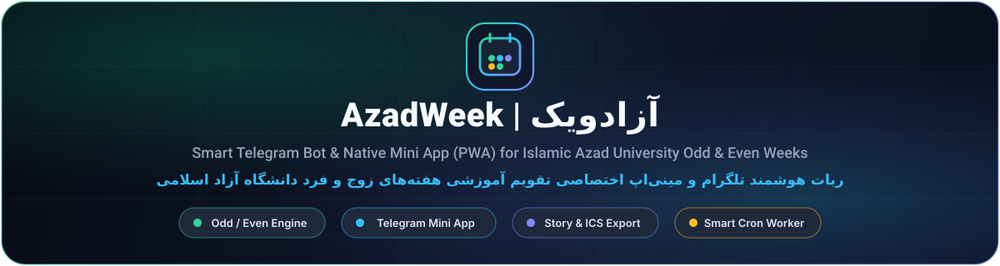

<div align="center">



<br />

[](https://t.me/AzadWeekBot)
[](https://arianpashae.com)
[](https://t.me/ArianPashaeChannel)
[](https://t.me/ComputerAzadKsh)
[](LICENSE)

<br />

<p align="center">
  
  &nbsp;<a href="#english-documentation"><b>English Documentation</b></a>
  &nbsp;&nbsp;|&nbsp;&nbsp;
  
  &nbsp;<a href="#مستندات-و-راهنمای-فارسی"><b>مستندات و راهنمای فارسی</b></a>
</p>

</div>

---

<a id="english-documentation"></a>

##  English Documentation

###  Overview

**AzadWeek** ([`@AzadWeekBot`](https://t.me/AzadWeekBot)) is a complete academic calendar ecosystem built for students and faculty of **Islamic Azad University**. It combines a fast, modular **Telegram Bot** (`AzadWeekBot/`) with a native **Telegram Mini App & Progressive Web App** (`AzadWeek/`) to track **Odd (فرد)** and **Even (زوج)** semester weeks, midterms, final exams, official holidays, and personal weekly class schedules on the Persian (Jalali) calendar.

---

###  Official Links & Channels

| Platform / Resource | Direct Link |
| :--- | :--- |
|  &nbsp;**AzadWeek Telegram Bot** | [t.me/AzadWeekBot](https://t.me/AzadWeekBot) |
|  &nbsp;**Official Website (Arian Pashae)** | [arianpashae.com](https://arianpashae.com) |
|  &nbsp;**Arian Pashae Telegram Channel** | [t.me/ArianPashaeChannel](https://t.me/ArianPashaeChannel) |
|  &nbsp;**Computer Engineering Channel** | [t.me/ComputerAzadKsh](https://t.me/ComputerAzadKsh) |
|  &nbsp;**Developer Direct Contact** | [t.me/ArianPashae](https://t.me/ArianPashae) |

---

###  Core Architecture & Features

####  1. Native Telegram Mini App & PWA (`AzadWeek/`)

-  **Live Odd/Even Week Dashboard**: Real-time indicator for the active semester week (`هفته فرد` / `هفته زوج`), week index, remaining weeks, live countdown timer, and semester progress bar.
-  **17-Week Interactive Semester Timeline & Date Finder**: Browse every week of the academic term with badges for add/drop, midterms, finals, and official holidays, or jump to any custom Jalali date (`1405/MM/DD`).
-  **Smart Weekly Class Planner**: Organize university courses by Odd, Even, or Every week with day, time slot, instructor name, classroom, and building — synced across local storage and your Telegram cloud profile.
-  **Story & Semester Wrapped Card Generator**: Renders high-resolution `1080×1920` visual cards (Current Status Card & Semester Wrapped Summary) via HTML5 Canvas and server-side PHP GD (`card.php`) with one-tap **Share to Telegram Story**, **Send to Bot Chat**, and **Direct Download**.
-  **Universal `.ics` Calendar Export**: Exports all Odd/Even semester weeks as a standard iCalendar (`.ics`) file compatible with Google Calendar, Apple Calendar, and Outlook, plus direct delivery in the Telegram bot chat.
-  **Personalized Weekly Reminders**: Schedule automated Telegram reminders for Friday or Saturday at your preferred hour (`08:00`, `14:00`, `20:00`, `22:00`) and test delivery immediately from the Mini App.
-  **Telegram WebApp 8.0+ Native Experience**: Mobile fullscreen header mode, tactile haptic feedback, native home-screen shortcut installation, biometric lock support, and dynamic dark/light theme synchronization.

####  2. Telegram Bot Backend (`AzadWeekBot/`)

-  **Private, Group & Inline Queries**: Instant week lookups for the current week, next week, or any Jalali date (`1405/07/15`), plus full **Inline Mode** (`@AzadWeekBot`) support in any chat.
-  **Multi-Channel Membership Gate**: Enforces subscription to required Telegram channels (`REQUIRED_CHANNELS`) with configurable TTL caching (`MEMBERSHIP_CACHE_TTL`) and instant verification callbacks.
-  **Smart Group Mode with Auto-Delete**: Responds to natural week questions in university groups and automatically deletes temporary bot replies after a configurable delay (`GROUP_STATUS_AUTODELETE_SECONDS`).
-  **Unified Cron Engine (`cron_sender.php`)**:
  - **Saturday 07:00 Broadcast**: Sends the new week's Odd/Even status to all subscribed users every Saturday morning.
  - **Custom Mini App Reminders**: Dispatches personalized user reminders according to each student's chosen day and hour.
  - **Rate-Limited Broadcast Queue**: Delivers admin announcements (text, photo, video, voice, GIF, or forwarded posts) in safe batches (`40 users/minute`).
  - **Group Message Cleanup**: Purges expired temporary bot messages in group chats.
-  **Admin Control Panel**: Live user analytics, daily/weekly growth metrics, queued broadcasting, and one-tap recall (deletion) of the last broadcast across all chats.

---

###  Repository Structure

```text
AzadWeekBot/
├── AzadWeek/                         # Telegram Mini App (WebApp) & PWA
│   ├── index.html                    # Main Mini App interface & responsive styles
│   ├── aw_native.js                  # Native WebApp controller, planner, canvas & sync
│   ├── connect.php                   # Mini App REST API (sync, reminders, .ics & card delivery)
│   ├── card.php                      # Server-side GD WebP visual card generator
│   ├── manifest.webmanifest          # PWA Web App Manifest
│   ├── sw.js                         # Offline Service Worker
│   └── assets/                       # Icons, fonts (Vazirmatn, Aviny), templates & SDK
│
├── AzadWeekBot/                      # Telegram Bot Core Backend
│   ├── bot.php                       # Main Telegram Webhook entry point
│   ├── config.php                    # Central configuration (Token, Channels, Admins, Weeks)
│   ├── cron_sender.php               # Background Cron worker (Reminders, Queue, Auto-Delete)
│   ├── jdf.php                       # Persian (Jalali) calendar conversion library
│   ├── lib/
│   │   ├── api.php                   # Telegram Bot API wrapper & Custom Emoji builder
│   │   ├── database.php              # Atomic JSON file storage engine
│   │   └── utils.php                 # Academic week calculation & string utilities
│   ├── assets/                       # WebP visual banners for bot commands
│   └── storage_backups/              # Protected runtime locks, caches & pending deletes
│
├── docs/icons/                       # Custom Premium SVG Icons & Hero Banner
├── LICENSE                           # MIT License
└── README.md                         # Bilingual Documentation (EN / FA)
```

---

###  Installation & Deployment Guide

####  Prerequisites
- **PHP 8.0 or higher** with `curl`, `mbstring`, `json`, and `gd` (WebP & FreeType enabled).
- An **HTTPS domain** (valid SSL certificate required by Telegram for Webhooks and Mini Apps).
- A **Telegram Bot Token** created via [@BotFather](https://t.me/BotFather).

####  Step 1: Clone & Upload to Your Host
1. Clone this repository:
   ```bash
   git clone https://github.com/ArianPashae/AzadWeekBot.git
   ```
2. Upload `AzadWeekBot/` and `AzadWeek/` to your HTTPS web server (for example, `https://example.com/AzadWeekBot/` and `https://example.com/AzadWeek/`).
   > `AzadWeek/connect.php` automatically locates `AzadWeekBot/config.php` when both folders are placed side-by-side (`../AzadWeekBot`) or when configured via the `AZAD_WEEK_BOT_ROOT` environment variable.

####  Step 2: Configure `AzadWeekBot/config.php`
Open `AzadWeekBot/config.php` and replace the placeholder values with your own environment settings:
```php
define('BOT_TOKEN', 'YOUR_BOT_TOKEN_HERE');
define('BOT_USERNAME', 'AzadWeekBot');
define('BASE_URL', 'https://example.com/AzadWeekBot/');
define('MINIAPP_URL', 'https://example.com/AzadWeek/?action=app&v=17');
define('ADMIN_IDS', ['YOUR_ADMIN_TELEGRAM_ID']);
define('CRON_SECRET_KEY', 'YOUR_CRON_SECRET_KEY');
```
- Configure `REQUIRED_CHANNELS` with your public or private channel identifiers (ensure the bot is promoted to administrator in each channel).
- Update `$weeks_config` at the bottom of `config.php` with the Jalali start and end dates (`YYYY/MM/DD`) of each semester week.

####  Step 3: Register the Telegram Webhook
Visit the following URL in your browser after replacing `<YOUR_BOT_TOKEN>` and your domain path:
```text
https://api.telegram.org/bot<YOUR_BOT_TOKEN>/setWebhook?url=https://example.com/AzadWeekBot/bot.php
```
On the first incoming update, the bot automatically syncs its slash commands and sets the **Open App** menu button to `MINIAPP_URL`.

####  Step 4: Set Up the Cron Job
Create a single Cron Job in **cPanel / DirectAdmin** or an external scheduler such as **[cron-job.org](https://cron-job.org)** running **every 1 minute** (`* * * * *`):
```text
https://example.com/AzadWeekBot/cron_sender.php?secret=YOUR_CRON_SECRET_KEY
```
Or via Linux crontab (`* * * * *`):
```bash
curl -s "https://example.com/AzadWeekBot/cron_sender.php?secret=YOUR_CRON_SECRET_KEY" >/dev/null 2>&1
```

---

<a id="مستندات-و-راهنمای-فارسی"></a>

<div dir="rtl" align="right">

##  مستندات و راهنمای فارسی

###  معرفی پروژه

**آزادویک (AzadWeek)** یک اکوسیستم کامل شامل **ربات هوشمند تلگرام** و **مینی‌اپ اختصاصی (Telegram Mini App / PWA)** برای دانشجویان و اساتید **دانشگاه آزاد اسلامی** است. این سامانه امکان مشاهدهٔ آنی وضعیت **هفتهٔ زوج یا فرد**، شمارهٔ هفتهٔ جاری، تقویم ۱۷ هفته‌ای ترم، روزشمار امتحانات میان‌ترم و پایان‌ترم، تعطیلات رسمی و مدیریت برنامهٔ کلاسی هفتگی را در محیطی مدرن و سریع فراهم می‌کند.

---

###  لینک‌های رسمی و راه‌های ارتباطی

| عنوان | لینک دسترسی |
| :--- | :--- |
|  &nbsp;**ربات تلگرام آزادویک** | [t.me/AzadWeekBot](https://t.me/AzadWeekBot) |
|  &nbsp;**وب‌سایت رسمی توسعه‌دهنده (آرین پاشایی)** | [arianpashae.com](https://arianpashae.com) |
|  &nbsp;**کانال تلگرام آرین پاشایی** | [t.me/ArianPashaeChannel](https://t.me/ArianPashaeChannel) |
|  &nbsp;**کانال مهندسی کامپیوتر دانشگاه آزاد کرمانشاه** | [t.me/ComputerAzadKsh](https://t.me/ComputerAzadKsh) |
|  &nbsp;**ارتباط مستقیم با توسعه‌دهنده** | [t.me/ArianPashae](https://t.me/ArianPashae) |

---

###  قابلیت‌ها و امکانات کلیدی

####  ۱. مینی‌اپ اختصاصی تلگرام و وب‌اپلیکیشن (`AzadWeek/`)

-  **داشبورد زندهٔ وضعیت هفته**: نمایش لحظه‌ای وضعیت هفتهٔ جاری (فرد یا زوج)، شمارهٔ هفتهٔ ترم، تعداد هفته‌های باقی‌مانده، تایمر شمارش معکوس تا پایان هفته و نوار پیشرفت ترم.
-  **تقویم تعاملی ۱۷ هفته‌ای و استعلام تاریخ**: مشاهدهٔ جدول کامل هفته‌های ترم به همراه برچسب تعطیلات رسمی، بازهٔ حذف و اضافه، میان‌ترم و امتحانات پایان‌ترم، و امکان جست‌وجوی هر تاریخ دلخواه شمسی.
-  **برنامه‌ریز هوشمند کلاس‌های دانشگاهی**: ثبت و دسته‌بندی کلاس‌ها بر اساس «هردو هفته»، «فقط هفته‌های فرد» و «فقط هفته‌های زوج» به همراه نام استاد، ساعت، شمارهٔ کلاس و دانشکده با قابلیت همگام‌سازی ابری روی اکانت تلگرام.
-  **مولد کارت استوری و کارنامهٔ ترم (Story & Wrapped Card)**: ساخت تصاویر گرافیکی باکیفیت (`1080×1920`) با فونت‌های وزیرمتن و آوینی، با قابلیت **اشتراک‌گذاری مستقیم در استوری تلگرام**، **ارسال آنی تصویر به چت ربات** و **دانلود مستقیم روی دستگاه**.
-  **خروجی استاندارد تقویم (`.ics`)**: دانلود مستقیم یا دریافت فایل تقویم کل ترم در چت ربات برای افزودن یک‌جای هفته‌های زوج و فرد به Google Calendar، Apple Calendar و Outlook.
-  **سیستم یادآور هفتگی شخصی‌سازی‌شده**: تنظیم دریافت نوتیفیکیشن خودکار در تلگرام برای روز دلخواه (جمعه یا شنبه) و ساعت انتخابی (`08:00`، `14:00`، `20:00` یا `22:00`) به همراه دکمهٔ تست آنی یادآور از داخل مینی‌اپ.
-  **یکپارچگی بومی با Telegram WebApp**: اجرای تمام‌صفحه (Fullscreen) خودکار در موبایل، بازخورد لرزشی (Haptic Feedback)، افزودن به صفحهٔ اصلی گوشی (Home Screen)، قفل بیومتریک و پشتیبانی از تم تیره و روشن.

####  ۲. هستهٔ ربات تلگرام (`AzadWeekBot/`)

-  **پاسخ‌گویی در چت خصوصی، گروه و حالت درون‌خطی (Inline)**: اعلام وضعیت هفتهٔ فعلی، هفتهٔ آینده، تقویم کامل ترم و تبدیل تاریخ شمسی (`1405/07/15`)، به همراه قابلیت استفادهٔ اینلاین با تایپ `@AzadWeekBot` در هر گفت‌وگویی.
-  **قفل عضویت اجباری چندکاناله**: بررسی هوشمند عضویت کاربران در کانال‌های تعریف‌شده (`REQUIRED_CHANNELS`) همراه با کش موقت برای افزایش سرعت پاسخ‌گویی.
-  **مدیریت هوشمند در گروه‌ها و حذف خودکار**: پاسخ به پرسش‌های وضعیت هفته در گروه‌های دانشجویی و پاک‌سازی خودکار پیام‌های موقت پس از ۲۰ ثانیه برای حفظ نظم گروه.
-  **موتور کرون‌جاب یکپارچه (`cron_sender.php`)**:
  - **اعلان خودکار شنبه‌ها ساعت ۰۷:۰۰ صبح**: اطلاع‌رسانی خودکار وضعیت هفتهٔ جدید به تمامی کاربران در آغاز هر هفته.
  - **ارسال یادآورهای اختصاصی مینی‌اپ**: ارسال پیام یادآور هفتگی بر اساس روز و ساعت تنظیم‌شده توسط هر کاربر.
  - **صف ارسال همگانی ایمن**: ارسال پیام‌های متنی، عکس، ویدیو، ویس، گیف و فوروارد همگانی در دسته‌های ۴۰تایی در هر دقیقه بدون برخورد با محدودیت‌های تلگرام.
  - **پاک‌سازی پیام‌های منقضی‌شدهٔ گروه**: حذف خودکار پاسخ‌های موقت ربات در گروه‌ها.
-  **پنل مدیریت پیشرفتهٔ ادمین**: مشاهدهٔ آمار لحظه‌ای کاربران، میزان رشد روزانه و هفتگی، ثبت ارسال همگانی و قابلیت حذف یک‌کلیکی آخرین پیام همگانی از چت تمامی کاربران.

---

###  آموزش نصب و راه‌اندازی

####  پیش‌نیازها
- **PHP نسخهٔ ۸.۰ یا بالاتر** به همراه افزونه‌های `curl`، `mbstring`، `json` و `gd` (با پشتیبانی از WebP و FreeType).
- **دامنه و هاست مجهز به گواهی SSL (پروتکل HTTPS)** جهت ثبت وبهوک و اجرای مینی‌اپ تلگرام.
- **توکن ربات تلگرام** دریافت‌شده از [@BotFather](https://t.me/BotFather).

####  گام اول: دریافت سورس و آپلود روی هاست
۱. مخزن پروژه را کلون یا دانلود کنید:
```bash
git clone https://github.com/ArianPashae/AzadWeekBot.git
```
۲. پوشه‌های `AzadWeekBot` و `AzadWeek` را روی هاست خود آپلود کنید (به‌عنوان مثال در مسیرهای `https://example.com/AzadWeekBot/` و `https://example.com/AzadWeek/`).
> فایل `AzadWeek/connect.php` به‌صورت خودکار پوشهٔ `AzadWeekBot` را در کنار پوشهٔ مینی‌اپ (`../AzadWeekBot`) یا از طریق متغیر محیطی `AZAD_WEEK_BOT_ROOT` شناسایی می‌کند.

####  گام دوم: پیکربندی فایل `AzadWeekBot/config.php`
فایل `AzadWeekBot/config.php` را باز کرده و مقادیر نمونه را با مقادیر اختصاصی خود جایگزین کنید:
```php
define('BOT_TOKEN', 'YOUR_BOT_TOKEN_HERE');
define('BOT_USERNAME', 'AzadWeekBot');
define('BASE_URL', 'https://example.com/AzadWeekBot/');
define('MINIAPP_URL', 'https://example.com/AzadWeek/?action=app&v=17');
define('ADMIN_IDS', ['YOUR_ADMIN_TELEGRAM_ID']);
define('CRON_SECRET_KEY', 'YOUR_CRON_SECRET_KEY');
```
- در آرایهٔ `REQUIRED_CHANNELS` آیدی و لینک کانال‌های موردنظر برای قفل عضویت اجباری را قرار دهید (ربات باید در این کانال‌ها ادمین باشد).
- در آرایهٔ `$weeks_config` در انتهای فایل `config.php`، تاریخ شروع و پایان هفته‌های ترم تحصیلی جدید را به شمسی وارد کنید.

####  گام سوم: ثبت وبهوک (Webhook) تلگرام
آدرس زیر را پس از جایگزینی `<YOUR_BOT_TOKEN>` و دامنهٔ خود در مرورگر باز کنید تا وبهوک ربات ثبت شود:
```text
https://api.telegram.org/bot<YOUR_BOT_TOKEN>/setWebhook?url=https://example.com/AzadWeekBot/bot.php
```
به محض دریافت اولین پیام، ربات به‌صورت خودکار دستورات منو و دکمهٔ **Open App** را روی آدرس مینی‌اپ شما تنظیم می‌کند.

####  گام چهارم: تنظیم کرون‌جاب (Cron Job)
برای فعال‌سازی اعلان شنبه‌ها، یادآورهای هفتگی مینی‌اپ، صف ارسال همگانی و حذف خودکار پیام‌های گروه، یک کرون‌جاب با بازهٔ زمانی **هر ۱ دقیقه (`* * * * *`)** در کنترل‌پنل هاست خود یا سرویس **[cron-job.org](https://cron-job.org)** روی آدرس زیر ایجاد کنید:
```text
https://example.com/AzadWeekBot/cron_sender.php?secret=YOUR_CRON_SECRET_KEY
```

---

###  توسعه‌دهنده و مجوز انتشار

این پروژه توسط **آرین پاشایی (Arian Pashae)** طراحی و توسعه یافته و تحت مجوز متن‌باز **[MIT License](LICENSE)** منتشر شده است.

-  **وب‌سایت رسمی**: [arianpashae.com](https://arianpashae.com)
-  **کانال تلگرام**: [@ArianPashaeChannel](https://t.me/ArianPashaeChannel)
-  **کانال مهندسی کامپیوتر**: [@ComputerAzadKsh](https://t.me/ComputerAzadKsh)
-  **ربات تلگرام آزادویک**: [@AzadWeekBot](https://t.me/AzadWeekBot)

</div>
